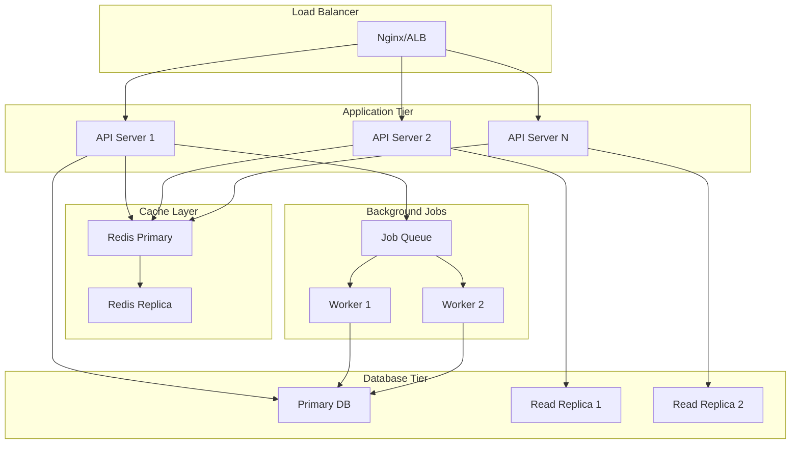

# PRP-024: Horizontal Scaling

## Goal

Implement horizontal scaling capabilities to support multi-tenant architecture, distributed processing, and high availability, enabling the system to handle thousands of concurrent users and millions of transactions.

## Why This Matters

- **Scalability**: Support business growth from startups to enterprise without architecture changes
- **Multi-tenancy**: Efficient resource utilization with tenant isolation
- **High Availability**: 99.99% uptime through redundancy and failover
- **Cost Efficiency**: Scale resources based on actual usage
- **Global Reach**: Deploy closer to users for lower latency

## What We're Building

A comprehensive horizontal scaling solution including:

1. Multi-tenant database architecture with Row-Level Security
2. Connection pooling and read replicas
3. Distributed job queue with Redis
4. Auto-scaling infrastructure
5. Tenant-aware caching strategy
6. Load balancing and health checks
7. Distributed rate limiting
8. Monitoring and alerting

## Context & References

### Codebase Patterns

- **Supabase RLS**: Already using Row-Level Security for data isolation
- **Redis Integration**: Caching layer already implemented (PRP-023)
- **Job Processing**: Background jobs from sync engine (PRP-015)
- **Multi-org Support**: Organization-based data model in place
- **API Structure**: RESTful APIs ready for gateway layer

### External Documentation

- **Supabase Multi-tenancy**: https://supabase.com/docs/guides/auth/row-level-security
- **PgBouncer**: https://www.pgbouncer.org/
- **Redis Cluster**: https://redis.io/docs/manual/scaling/
- **BullMQ**: https://docs.bullmq.io/
- **Kubernetes HPA**: https://kubernetes.io/docs/tasks/run-application/horizontal-pod-autoscale/
- **Grafana Stack**: https://grafana.com/docs/

## Implementation Blueprint

### Phase 1: Database Multi-tenancy Enhancement

```sql
-- Enhanced tenant isolation with performance optimizations
-- supabase/migrations/20250803_prp_024_multi_tenant.sql

-- Add tenant sharding hint
ALTER TABLE organizations ADD COLUMN IF NOT EXISTS shard_key INTEGER;

-- Function to calculate shard key
CREATE OR REPLACE FUNCTION calculate_shard_key(org_id UUID)
RETURNS INTEGER AS $$
BEGIN
  -- Simple modulo sharding for demonstration
  -- In production, use consistent hashing
  RETURN abs(hashtext(org_id::text)) % 100;
END;
$$ LANGUAGE plpgsql IMMUTABLE;

-- Update existing organizations
UPDATE organizations 
SET shard_key = calculate_shard_key(id)
WHERE shard_key IS NULL;

-- Create index for shard-based queries
CREATE INDEX idx_organizations_shard ON organizations(shard_key);

-- Tenant usage tracking
CREATE TABLE IF NOT EXISTS tenant_usage (
  id UUID PRIMARY KEY DEFAULT gen_random_uuid(),
  organization_id UUID REFERENCES organizations(id) NOT NULL,
  metric_name TEXT NOT NULL,
  metric_value NUMERIC NOT NULL,
  measured_at TIMESTAMPTZ DEFAULT NOW(),
  
  -- Partition by month for efficient cleanup
  created_month DATE GENERATED ALWAYS AS (DATE_TRUNC('month', measured_at)) STORED
);

-- Create partitions for tenant usage
CREATE TABLE tenant_usage_2025_01 PARTITION OF tenant_usage
  FOR VALUES FROM ('2025-01-01') TO ('2025-02-01');

CREATE TABLE tenant_usage_2025_02 PARTITION OF tenant_usage
  FOR VALUES FROM ('2025-02-01') TO ('2025-03-01');

-- Add more partitions as needed...

-- Connection limit per tenant
CREATE TABLE tenant_limits (
  organization_id UUID PRIMARY KEY REFERENCES organizations(id),
  max_connections INTEGER DEFAULT 10,
  max_api_calls_per_hour INTEGER DEFAULT 10000,
  max_storage_gb INTEGER DEFAULT 100,
  max_users INTEGER DEFAULT 50,
  tier TEXT DEFAULT 'free' CHECK (tier IN ('free', 'starter', 'professional', 'enterprise')),
  updated_at TIMESTAMPTZ DEFAULT NOW()
);

-- Function to check tenant limits
CREATE OR REPLACE FUNCTION check_tenant_limit(
  org_id UUID,
  limit_type TEXT,
  current_value INTEGER
) RETURNS BOOLEAN AS $$
DECLARE
  limit_value INTEGER;
BEGIN
  CASE limit_type
    WHEN 'connections' THEN
      SELECT max_connections INTO limit_value
      FROM tenant_limits WHERE organization_id = org_id;
    WHEN 'api_calls' THEN
      SELECT max_api_calls_per_hour INTO limit_value
      FROM tenant_limits WHERE organization_id = org_id;
    WHEN 'users' THEN
      SELECT max_users INTO limit_value
      FROM tenant_limits WHERE organization_id = org_id;
    ELSE
      RETURN TRUE; -- Unknown limit type, allow
  END CASE;

  RETURN current_value < COALESCE(limit_value, 999999);
END;
$$ LANGUAGE plpgsql;

-- Create composite indexes for common tenant queries
CREATE INDEX idx_products_org_shard ON products(organization_id, (SELECT shard_key FROM organizations WHERE id = organization_id));
CREATE INDEX idx_inventory_org_shard ON inventory(organization_id, (SELECT shard_key FROM organizations WHERE id = organization_id));
CREATE INDEX idx_orders_org_shard ON orders(organization_id, (SELECT shard_key FROM organizations WHERE id = organization_id));
```

### Phase 2: Connection Pooling

```typescript
// lib/db/connection-pool.ts
import { Pool } from 'pg'
import { createClient } from '@supabase/supabase-js'

interface PoolConfig {
  max: number
  idleTimeoutMillis: number
  connectionTimeoutMillis: number
}

class TenantAwarePool {
  private pools: Map<string, Pool> = new Map()
  private defaultConfig: PoolConfig = {
    max: 20,
    idleTimeoutMillis: 30000,
    connectionTimeoutMillis: 2000,
  }

  getPool(tenantId: string, shardKey?: number): Pool {
    const poolKey = shardKey ? `${tenantId}-shard-${shardKey}` : tenantId
    
    if (!this.pools.has(poolKey)) {
      const pool = new Pool({
        ...this.defaultConfig,
        // In production, route to different databases based on shard
        connectionString: this.getConnectionString(shardKey),
        // Add tenant context to all queries
        options: `-c app.tenant_id=${tenantId}`,
      })

      // Monitor pool health
      pool.on('error', (err) => {
        console.error(`Pool error for tenant ${tenantId}:`, err)
        // Send to monitoring service
      })

      this.pools.set(poolKey, pool)
    }

    return this.pools.get(poolKey)!
  }

  private getConnectionString(shardKey?: number): string {
    // In production, return different connection strings based on shard
    // For now, use read replicas for read-heavy operations
    if (shardKey && shardKey % 2 === 0) {
      return process.env.DATABASE_REPLICA_URL || process.env.DATABASE_URL!
    }
    return process.env.DATABASE_URL!
  }

  async query(tenantId: string, text: string, params: any[], shardKey?: number) {
    const pool = this.getPool(tenantId, shardKey)
    
    // Add tenant context
    const contextQuery = `SET app.tenant_id = '${tenantId}'`
    const client = await pool.connect()
    
    try {
      await client.query(contextQuery)
      const result = await client.query(text, params)
      return result
    } finally {
      client.release()
    }
  }

  async end() {
    const promises = Array.from(this.pools.values()).map(pool => pool.end())
    await Promise.all(promises)
    this.pools.clear()
  }
}

export const tenantPool = new TenantAwarePool()
```

### Phase 3: Distributed Job Queue

```typescript
// lib/queue/distributed-queue.ts
import { Queue, Worker, QueueScheduler } from 'bullmq'
import { Redis } from 'ioredis'

// Redis cluster configuration
const redisConfig = {
  port: parseInt(process.env.REDIS_PORT || '6379'),
  host: process.env.REDIS_HOST || 'localhost',
  password: process.env.REDIS_PASSWORD,
  maxRetriesPerRequest: 3,
  enableReadyCheck: true,
  retryStrategy: (times: number) => {
    const delay = Math.min(times * 50, 2000)
    return delay
  },
}

// Create Redis connections
const createRedisConnection = () => new Redis(redisConfig)

// Job queues by priority and type
export const queues = {
  critical: new Queue('critical', { connection: createRedisConnection() }),
  high: new Queue('high', { connection: createRedisConnection() }),
  normal: new Queue('normal', { connection: createRedisConnection() }),
  low: new Queue('low', { connection: createRedisConnection() }),
  bulk: new Queue('bulk', { connection: createRedisConnection() }),
}

// Queue schedulers for delayed jobs
const schedulers = Object.entries(queues).map(([name, queue]) => 
  new QueueScheduler(name, { connection: createRedisConnection() })
)

// Job types
export interface TenantJob {
  tenantId: string
  type: string
  data: any
  priority?: number
  delay?: number
  attempts?: number
}

// Add job with tenant context
export async function addTenantJob(job: TenantJob) {
  const queueName = getQueueForJob(job)
  const queue = queues[queueName as keyof typeof queues]
  
  return queue.add(job.type, job, {
    priority: job.priority || 0,
    delay: job.delay || 0,
    attempts: job.attempts || 3,
    backoff: {
      type: 'exponential',
      delay: 2000,
    },
    removeOnComplete: {
      age: 3600, // 1 hour
      count: 100,
    },
    removeOnFail: {
      age: 24 * 3600, // 24 hours
    },
  })
}

function getQueueForJob(job: TenantJob): string {
  // Route jobs based on type and tenant tier
  if (job.type.includes('sync') || job.type.includes('critical')) {
    return 'critical'
  }
  if (job.type.includes('report') || job.type.includes('export')) {
    return 'high'
  }
  if (job.type.includes('bulk')) {
    return 'bulk'
  }
  return 'normal'
}

// Worker factory with tenant isolation
export function createTenantWorker(
  queueName: keyof typeof queues,
  processor: (job: any) => Promise<any>
) {
  const worker = new Worker(
    queueName,
    async (job) => {
      // Set tenant context for the job
      const tenantId = job.data.tenantId
      
      try {
        // Add tenant context to async local storage
        return await runWithTenant(tenantId, () => processor(job))
      } catch (error) {
        console.error(`Job ${job.id} failed for tenant ${tenantId}:`, error)
        throw error
      }
    },
    {
      connection: createRedisConnection(),
      concurrency: getConcurrencyForQueue(queueName),
      limiter: {
        max: 100,
        duration: 60000, // per minute
      },
    }
  )

  // Monitor worker health
  worker.on('completed', (job) => {
    console.log(`Job ${job.id} completed for tenant ${job.data.tenantId}`)
  })

  worker.on('failed', (job, err) => {
    console.error(`Job ${job?.id} failed:`, err)
  })

  return worker
}

function getConcurrencyForQueue(queueName: string): number {
  const concurrencyMap = {
    critical: 10,
    high: 8,
    normal: 5,
    low: 3,
    bulk: 2,
  }
  return concurrencyMap[queueName as keyof typeof concurrencyMap] || 5
}

// Async local storage for tenant context
import { AsyncLocalStorage } from 'async_hooks'

const tenantContext = new AsyncLocalStorage<{ tenantId: string }>()

export function runWithTenant<T>(tenantId: string, fn: () => T): T {
  return tenantContext.run({ tenantId }, fn)
}

export function getCurrentTenant(): string | undefined {
  return tenantContext.getStore()?.tenantId
}
```

### Phase 4: Auto-scaling Configuration

```yaml
# k8s/deployment.yaml
apiVersion: apps/v1
kind: Deployment
metadata:
  name: inventory-api
  labels:
    app: inventory-api
spec:
  replicas: 3
  selector:
    matchLabels:
      app: inventory-api
  template:
    metadata:
      labels:
        app: inventory-api
    spec:
      containers:
      - name: api
        image: inventory-system:latest
        ports:
        - containerPort: 3000
        env:
        - name: NODE_ENV
          value: "production"
        - name: DATABASE_URL
          valueFrom:
            secretKeyRef:
              name: db-secrets
              key: url
        resources:
          requests:
            memory: "256Mi"
            cpu: "250m"
          limits:
            memory: "512Mi"
            cpu: "500m"
        livenessProbe:
          httpGet:
            path: /api/health
            port: 3000
          initialDelaySeconds: 30
          periodSeconds: 10
        readinessProbe:
          httpGet:
            path: /api/ready
            port: 3000
          initialDelaySeconds: 5
          periodSeconds: 5
---
apiVersion: autoscaling/v2
kind: HorizontalPodAutoscaler
metadata:
  name: inventory-api-hpa
spec:
  scaleTargetRef:
    apiVersion: apps/v1
    kind: Deployment
    name: inventory-api
  minReplicas: 3
  maxReplicas: 20
  metrics:
  - type: Resource
    resource:
      name: cpu
      target:
        type: Utilization
        averageUtilization: 70
  - type: Resource
    resource:
      name: memory
      target:
        type: Utilization
        averageUtilization: 80
  - type: Pods
    pods:
      metric:
        name: http_requests_per_second
      target:
        type: AverageValue
        averageValue: "1000"
  behavior:
    scaleDown:
      stabilizationWindowSeconds: 300
      policies:
      - type: Percent
        value: 10
        periodSeconds: 60
    scaleUp:
      stabilizationWindowSeconds: 60
      policies:
      - type: Percent
        value: 50
        periodSeconds: 60
      - type: Pods
        value: 2
        periodSeconds: 60
```

### Phase 5: Tenant-aware Caching

```typescript
// lib/cache/tenant-cache.ts
import { redis, CACHE_TTL, cacheKey } from '@/lib/cache/redis-client'
import { getCurrentTenant } from '@/lib/queue/distributed-queue'

export interface TenantCacheOptions {
  ttl?: number
  namespace?: string
  isolated?: boolean // Whether cache should be tenant-specific
}

export class TenantCache {
  // Get cache with tenant isolation
  async get<T>(
    key: string,
    options: TenantCacheOptions = {}
  ): Promise<T | null> {
    const tenantId = getCurrentTenant()
    const cacheKey = this.buildKey(key, tenantId, options)
    
    try {
      const cached = await redis?.get<T>(cacheKey)
      if (cached) {
        // Track cache hit rate per tenant
        await this.trackCacheMetric(tenantId, 'hit')
      }
      return cached
    } catch (error) {
      console.error(`Cache get error for tenant ${tenantId}:`, error)
      return null
    }
  }

  // Set cache with tenant isolation
  async set<T>(
    key: string,
    value: T,
    options: TenantCacheOptions = {}
  ): Promise<void> {
    const tenantId = getCurrentTenant()
    const cacheKey = this.buildKey(key, tenantId, options)
    const ttl = options.ttl || CACHE_TTL.MEDIUM
    
    try {
      await redis?.setex(cacheKey, ttl, JSON.stringify(value))
      await this.trackCacheMetric(tenantId, 'set')
    } catch (error) {
      console.error(`Cache set error for tenant ${tenantId}:`, error)
    }
  }

  // Invalidate tenant cache
  async invalidate(pattern: string, options: TenantCacheOptions = {}): Promise<void> {
    const tenantId = getCurrentTenant()
    const searchPattern = this.buildKey(pattern, tenantId, options)
    
    try {
      let cursor = 0
      const keysToDelete: string[] = []

      do {
        const result = await redis?.scan(cursor, {
          match: searchPattern,
          count: 100,
        })
        
        if (result) {
          cursor = result[0]
          keysToDelete.push(...result[1])
        }
      } while (cursor !== 0)

      if (keysToDelete.length > 0) {
        await redis?.del(...keysToDelete)
        await this.trackCacheMetric(tenantId, 'invalidate', keysToDelete.length)
      }
    } catch (error) {
      console.error(`Cache invalidation error for tenant ${tenantId}:`, error)
    }
  }

  // Build cache key with tenant context
  private buildKey(
    key: string,
    tenantId?: string,
    options: TenantCacheOptions = {}
  ): string {
    const parts: string[] = []
    
    if (options.namespace) {
      parts.push(options.namespace)
    }
    
    if (options.isolated !== false && tenantId) {
      parts.push(`tenant:${tenantId}`)
    }
    
    parts.push(key)
    
    return parts.join(':')
  }

  // Track cache metrics per tenant
  private async trackCacheMetric(
    tenantId?: string,
    operation: 'hit' | 'miss' | 'set' | 'invalidate',
    count: number = 1
  ): Promise<void> {
    if (!tenantId) return
    
    const metric = `cache:${operation}:${tenantId}`
    const hourKey = `${metric}:${new Date().getHours()}`
    
    try {
      await redis?.incrby(hourKey, count)
      await redis?.expire(hourKey, 3600 * 24) // 24 hour retention
    } catch (error) {
      // Ignore metric tracking errors
    }
  }

  // Get cache statistics for a tenant
  async getStats(tenantId: string): Promise<{
    hits: number
    misses: number
    sets: number
    invalidations: number
    hitRate: number
  }> {
    const hour = new Date().getHours()
    const keys = {
      hits: `cache:hit:${tenantId}:${hour}`,
      misses: `cache:miss:${tenantId}:${hour}`,
      sets: `cache:set:${tenantId}:${hour}`,
      invalidations: `cache:invalidate:${tenantId}:${hour}`,
    }

    const [hits, misses, sets, invalidations] = await Promise.all([
      redis?.get<number>(keys.hits) || 0,
      redis?.get<number>(keys.misses) || 0,
      redis?.get<number>(keys.sets) || 0,
      redis?.get<number>(keys.invalidations) || 0,
    ])

    const total = (hits as number) + (misses as number)
    const hitRate = total > 0 ? (hits as number) / total : 0

    return {
      hits: hits as number,
      misses: misses as number,
      sets: sets as number,
      invalidations: invalidations as number,
      hitRate,
    }
  }
}

export const tenantCache = new TenantCache()
```

### Phase 6: Health Checks and Monitoring

```typescript
// app/api/health/route.ts
import { NextResponse } from 'next/server'
import { createServerClient } from '@/lib/supabase/server'
import { redis } from '@/lib/cache/redis-client'
import { tenantPool } from '@/lib/db/connection-pool'

interface HealthCheck {
  status: 'healthy' | 'degraded' | 'unhealthy'
  checks: {
    database: CheckResult
    cache: CheckResult
    queue: CheckResult
    storage: CheckResult
  }
  timestamp: string
  version: string
}

interface CheckResult {
  status: 'ok' | 'error'
  latency?: number
  error?: string
}

export async function GET() {
  const health: HealthCheck = {
    status: 'healthy',
    checks: {
      database: { status: 'ok' },
      cache: { status: 'ok' },
      queue: { status: 'ok' },
      storage: { status: 'ok' },
    },
    timestamp: new Date().toISOString(),
    version: process.env.APP_VERSION || '1.0.0',
  }

  // Check database
  try {
    const start = Date.now()
    const supabase = createServerClient()
    const { error } = await supabase.from('organizations').select('id').limit(1)
    
    if (error) throw error
    
    health.checks.database = {
      status: 'ok',
      latency: Date.now() - start,
    }
  } catch (error) {
    health.status = 'unhealthy'
    health.checks.database = {
      status: 'error',
      error: 'Database connection failed',
    }
  }

  // Check cache
  try {
    const start = Date.now()
    await redis?.ping()
    
    health.checks.cache = {
      status: 'ok',
      latency: Date.now() - start,
    }
  } catch (error) {
    health.status = health.status === 'unhealthy' ? 'unhealthy' : 'degraded'
    health.checks.cache = {
      status: 'error',
      error: 'Cache connection failed',
    }
  }

  // Check queue (Redis)
  try {
    const start = Date.now()
    // Simple Redis check - in production, check actual queue health
    const testKey = `health:${Date.now()}`
    await redis?.setex(testKey, 10, 'ok')
    await redis?.del(testKey)
    
    health.checks.queue = {
      status: 'ok',
      latency: Date.now() - start,
    }
  } catch (error) {
    health.status = health.status === 'unhealthy' ? 'unhealthy' : 'degraded'
    health.checks.queue = {
      status: 'error',
      error: 'Queue system unavailable',
    }
  }

  // Return appropriate status code
  const statusCode = health.status === 'healthy' ? 200 : 
                    health.status === 'degraded' ? 200 : 503

  return NextResponse.json(health, { status: statusCode })
}

// Readiness check - more strict than health
export async function HEAD() {
  try {
    // Quick checks only
    const supabase = createServerClient()
    await Promise.all([
      supabase.from('organizations').select('id').limit(1),
      redis?.ping(),
    ])
    
    return new Response(null, { status: 200 })
  } catch (error) {
    return new Response(null, { status: 503 })
  }
}
```

### Phase 7: Rate Limiting

```typescript
// lib/rate-limit/distributed-limiter.ts
import { Ratelimit } from '@upstash/ratelimit'
import { Redis } from '@upstash/redis'

// Different rate limiters for different operations
export const rateLimiters = {
  api: new Ratelimit({
    redis: Redis.fromEnv(),
    limiter: Ratelimit.slidingWindow(100, '1 m'), // 100 requests per minute
    analytics: true,
  }),
  
  auth: new Ratelimit({
    redis: Redis.fromEnv(),
    limiter: Ratelimit.fixedWindow(5, '15 m'), // 5 attempts per 15 minutes
    analytics: true,
  }),
  
  export: new Ratelimit({
    redis: Redis.fromEnv(),
    limiter: Ratelimit.tokenBucket(10, '1 h', 10), // 10 exports per hour
    analytics: true,
  }),
  
  bulk: new Ratelimit({
    redis: Redis.fromEnv(),
    limiter: Ratelimit.tokenBucket(5, '1 h', 5), // 5 bulk operations per hour
    analytics: true,
  }),
}

// Tenant-specific rate limiting
export async function checkTenantRateLimit(
  tenantId: string,
  operation: keyof typeof rateLimiters = 'api'
): Promise<{ allowed: boolean; reset: number; remaining: number }> {
  const limiter = rateLimiters[operation]
  const identifier = `${tenantId}:${operation}`
  
  const { success, limit, reset, remaining } = await limiter.limit(identifier)
  
  // Log rate limit hits
  if (!success) {
    console.warn(`Rate limit exceeded for tenant ${tenantId} on ${operation}`)
    
    // Could trigger alerts or auto-scaling here
    await trackRateLimitEvent(tenantId, operation)
  }
  
  return {
    allowed: success,
    reset,
    remaining,
  }
}

async function trackRateLimitEvent(tenantId: string, operation: string) {
  // Track in database for analytics
  try {
    const supabase = createServerClient()
    await supabase.from('tenant_usage').insert({
      organization_id: tenantId,
      metric_name: `rate_limit_exceeded_${operation}`,
      metric_value: 1,
    })
  } catch (error) {
    console.error('Failed to track rate limit event:', error)
  }
}

// Middleware for rate limiting
export async function rateLimitMiddleware(
  request: Request,
  tenantId: string,
  operation: keyof typeof rateLimiters = 'api'
) {
  const { allowed, reset, remaining } = await checkTenantRateLimit(tenantId, operation)
  
  if (!allowed) {
    return new Response('Too Many Requests', {
      status: 429,
      headers: {
        'X-RateLimit-Limit': '100',
        'X-RateLimit-Remaining': '0',
        'X-RateLimit-Reset': reset.toString(),
        'Retry-After': Math.floor((reset - Date.now()) / 1000).toString(),
      },
    })
  }
  
  // Add rate limit headers to response
  return {
    headers: {
      'X-RateLimit-Limit': '100',
      'X-RateLimit-Remaining': remaining.toString(),
      'X-RateLimit-Reset': reset.toString(),
    },
  }
}
```

### Phase 8: Monitoring Dashboard

```typescript
// app/api/metrics/route.ts
import { NextResponse } from 'next/server'
import { createServerClient } from '@/lib/supabase/server'
import { getCurrentUser } from '@/lib/supabase/auth'
import { tenantCache } from '@/lib/cache/tenant-cache'
import { tenantPool } from '@/lib/db/connection-pool'

export async function GET(request: Request) {
  try {
    const user = await getCurrentUser()
    if (!user || user.role !== 'admin') {
      return NextResponse.json({ error: 'Unauthorized' }, { status: 401 })
    }

    // Collect metrics
    const [dbMetrics, cacheMetrics, tenantMetrics] = await Promise.all([
      getDatabaseMetrics(),
      getCacheMetrics(user.organizationId),
      getTenantMetrics(user.organizationId),
    ])

    return NextResponse.json({
      database: dbMetrics,
      cache: cacheMetrics,
      tenant: tenantMetrics,
      timestamp: new Date().toISOString(),
    })
  } catch (error) {
    console.error('Metrics error:', error)
    return NextResponse.json(
      { error: 'Failed to fetch metrics' },
      { status: 500 }
    )
  }
}

async function getDatabaseMetrics() {
  const supabase = createServerClient()
  
  // Get connection stats
  const { data: stats } = await supabase.rpc('get_db_stats')
  
  return {
    activeConnections: stats?.active_connections || 0,
    idleConnections: stats?.idle_connections || 0,
    waitingClients: stats?.waiting_clients || 0,
    maxConnections: stats?.max_connections || 100,
  }
}

async function getCacheMetrics(tenantId: string) {
  const stats = await tenantCache.getStats(tenantId)
  
  return {
    hitRate: (stats.hitRate * 100).toFixed(2) + '%',
    operations: {
      hits: stats.hits,
      misses: stats.misses,
      sets: stats.sets,
      invalidations: stats.invalidations,
    },
  }
}

async function getTenantMetrics(tenantId: string) {
  const supabase = createServerClient()
  
  const { data: usage } = await supabase
    .from('tenant_usage')
    .select('metric_name, metric_value')
    .eq('organization_id', tenantId)
    .gte('measured_at', new Date(Date.now() - 3600000).toISOString()) // Last hour
  
  const metrics: Record<string, number> = {}
  
  usage?.forEach(u => {
    metrics[u.metric_name] = (metrics[u.metric_name] || 0) + u.metric_value
  })
  
  return metrics
}
```

## Deployment Strategy

### Production Architecture



### Scaling Triggers

1. **CPU Usage**: Scale up at 70% CPU utilization
2. **Memory Usage**: Scale up at 80% memory utilization
3. **Request Rate**: Scale up at 1000 req/s per pod
4. **Response Time**: Scale up if p95 latency > 500ms
5. **Queue Depth**: Scale workers if queue depth > 1000

### Monitoring & Alerts

1. **Tenant Health Dashboard**: Real-time metrics per tenant
2. **Resource Usage Alerts**: CPU, memory, connections
3. **Error Rate Monitoring**: 5xx errors, timeouts
4. **SLA Tracking**: Uptime, response times
5. **Cost Attribution**: Resource usage per tenant