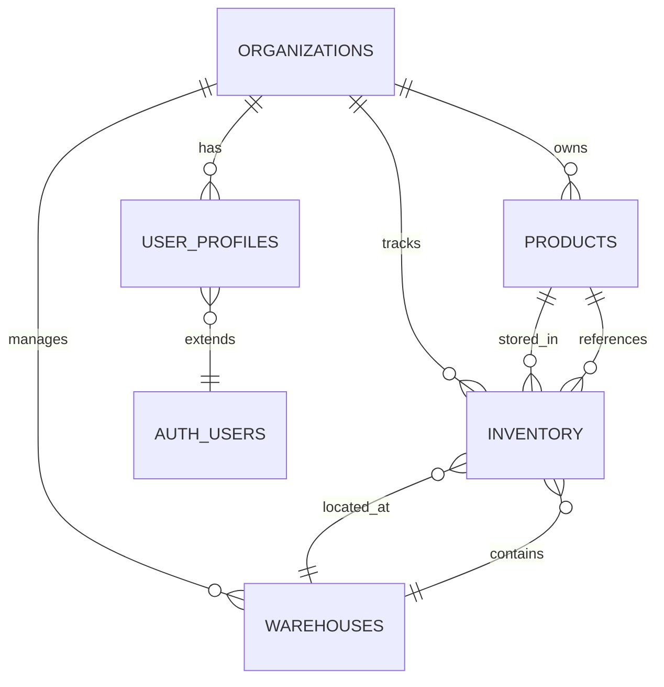

# TruthSource Database Schema

## Overview

TruthSource uses a multi-tenant PostgreSQL database architecture with Row Level Security (RLS) to ensure data isolation between organizations. All tables use UUID primary keys and include audit timestamps.

## Entity Relationship Diagram



## Core Tables

### organizations
Root table for multi-tenancy. Each customer company is an organization.

| Column | Type | Description |
|--------|------|-------------|
| id | UUID | Primary key |
| name | TEXT | Organization display name |
| slug | TEXT | Unique URL-friendly identifier |
| subscription_tier | ENUM | Plan level: starter, professional, enterprise |
| subscription_status | ENUM | Status: active, trialing, past_due, canceled |
| settings | JSONB | Organization-specific configuration |
| created_at | TIMESTAMPTZ | Creation timestamp |
| updated_at | TIMESTAMPTZ | Last update timestamp |

### user_profiles
Extends Supabase auth.users with organization membership and roles.

| Column | Type | Description |
|--------|------|-------------|
| id | UUID | Primary key |
| user_id | UUID | References auth.users(id) |
| organization_id | UUID | References organizations(id) |
| full_name | TEXT | User's display name |
| role | ENUM | User role: owner, admin, member |
| permissions | JSONB | Additional granular permissions |
| created_at | TIMESTAMPTZ | Creation timestamp |
| updated_at | TIMESTAMPTZ | Last update timestamp |

### products
Master product catalog for each organization.

| Column | Type | Description |
|--------|------|-------------|
| id | UUID | Primary key |
| organization_id | UUID | References organizations(id) |
| sku | TEXT | Stock keeping unit (unique per org) |
| name | TEXT | Product name |
| description | TEXT | Product description |
| category | TEXT | Product category |
| base_price | DECIMAL(12,2) | Standard selling price |
| cost | DECIMAL(12,2) | Cost of goods |
| weight | DECIMAL(10,3) | Weight in pounds |
| dimensions | JSONB | {length, width, height, unit} |
| image_url | TEXT | Product image URL |
| active | BOOLEAN | Is product active? |
| metadata | JSONB | Additional product data |
| created_at | TIMESTAMPTZ | Creation timestamp |
| updated_at | TIMESTAMPTZ | Last update timestamp |

### warehouses
Physical locations where inventory is stored.

| Column | Type | Description |
|--------|------|-------------|
| id | UUID | Primary key |
| organization_id | UUID | References organizations(id) |
| name | TEXT | Warehouse name |
| code | TEXT | Warehouse code (unique per org) |
| address | JSONB | {street, city, state, zip, country} |
| contact | JSONB | {phone, email, manager} |
| is_default | BOOLEAN | Default warehouse for new inventory |
| active | BOOLEAN | Is warehouse operational? |
| created_at | TIMESTAMPTZ | Creation timestamp |
| updated_at | TIMESTAMPTZ | Last update timestamp |

### inventory
Junction table tracking product quantities at each warehouse.

| Column | Type | Description |
|--------|------|-------------|
| id | UUID | Primary key |
| organization_id | UUID | References organizations(id) |
| product_id | UUID | References products(id) |
| warehouse_id | UUID | References warehouses(id) |
| quantity | INTEGER | Available quantity |
| reserved_quantity | INTEGER | Quantity allocated to orders |
| reorder_point | INTEGER | Minimum quantity before reorder |
| reorder_quantity | INTEGER | Quantity to order when below minimum |
| last_counted_at | TIMESTAMPTZ | Last physical count date |
| last_counted_by | UUID | References auth.users(id) |
| created_at | TIMESTAMPTZ | Creation timestamp |
| updated_at | TIMESTAMPTZ | Last update timestamp |

## Row Level Security (RLS) Policies

All tables have RLS enabled to ensure data isolation:

### Organization Isolation
- Users can only see data from their own organization
- Organization ID is checked against user's profile
- Service role key bypasses RLS for admin operations

### Role-Based Access
- **Owner**: Full access to all organization data
- **Admin**: Can manage users, products, and inventory
- **Member**: Can view and update inventory levels

### Policy Examples

```sql
-- Users can only see their organization's products
CREATE POLICY "Users can view products in their org"
  ON products FOR SELECT
  USING (organization_id = get_user_organization_id(auth.uid()));

-- Only admins can manage warehouses
CREATE POLICY "Admins can manage warehouses in their org"
  ON warehouses FOR ALL
  USING (
    organization_id = get_user_organization_id(auth.uid())
    AND is_org_admin(auth.uid(), organization_id)
  );
```

## Helper Functions

### get_user_organization_id(user_uuid)
Returns the organization ID for a given user.

### is_org_member(user_uuid, org_uuid)
Checks if a user is a member of an organization.

### is_org_admin(user_uuid, org_uuid)
Checks if a user has admin or owner role in an organization.

## Indexes

Performance indexes are created for:
- Foreign key relationships
- Common query patterns (org + SKU, org + category)
- Low stock alerts (quantity <= reorder_point)
- Active/default flags

## Triggers

### handle_new_user()
- Fires after auth.users INSERT
- Creates user_profile record
- Creates organization if needed
- First user becomes owner

### update_updated_at()
- Updates the updated_at timestamp on row changes
- Applied to all tables

## Best Practices

1. **Always use UUIDs** - Never expose sequential IDs
2. **Enable RLS** - Every table must have RLS policies
3. **Use TIMESTAMPTZ** - Store timestamps with timezone
4. **Composite Constraints** - SKU unique per organization
5. **Cascade Deletes** - Maintain referential integrity
6. **Audit Trail** - Track who changed inventory counts
7. **Soft Deletes** - Use active flags instead of DELETE

## Migration Management

1. Migrations are in `supabase/migrations/`
2. Each migration must be idempotent (IF NOT EXISTS)
3. Never modify existing migrations
4. Test migrations on a copy before production
5. Use `supabase db push` for local development
6. Use `supabase db reset` to start fresh

## Common Queries

### Get products with inventory levels
```sql
SELECT 
  p.*,
  i.quantity,
  i.reserved_quantity,
  w.name as warehouse_name
FROM products p
JOIN inventory i ON p.id = i.product_id
JOIN warehouses w ON i.warehouse_id = w.id
WHERE p.organization_id = get_user_organization_id(auth.uid())
  AND p.active = true
ORDER BY p.name;
```

### Find low stock items
```sql
SELECT 
  p.sku,
  p.name,
  i.quantity,
  i.reorder_point,
  w.name as warehouse
FROM inventory i
JOIN products p ON i.product_id = p.id
JOIN warehouses w ON i.warehouse_id = w.id
WHERE i.organization_id = get_user_organization_id(auth.uid())
  AND i.quantity <= i.reorder_point
ORDER BY (i.quantity::float / NULLIF(i.reorder_point, 0)) ASC;
```